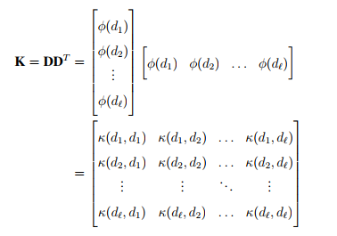

# Authorship-Attribution
My master thesis [[1]](#1) in Statistics at Uppsala University about Authorship classification using the vector space model and kernel methods

> Author: Emil Westin. 

> Master thesis, Department of statistics, Uppsala University.

## Abstract

Authorship identification is the field of classifying a given text by its author based on the
assumption that authors exhibit unique writing styles. This thesis investigates the semantic
shortcomings of the vector space model by constructing a semantic kernel created from WordNet which is evaluated on the problem of authorship attribution. A multiclass SVM classifier
is constructed using the one-versus-all strategy and evaluated in terms of precision, recall, accuracy and F1 scores. Results show that the use of the semantic scores from WordNet degrades
the performance compared to using a linear kernel. Experiments are run to identify the best feature engineering configurations, showing that removing stopwords has a positive effect on the
financial dataset Reuters while the Kaggle dataset consisting of short extracts of horror stories
benefit from keeping the stopwords.

## Introduction

- **Authorship identification**: classify a given text by its author based on the assumption that authors exhibit
unique writing styles
- Goals of thesis:
- Investigate semantic shortcomings of vector space model by constructing and evaluating a semantic
kernel compared to a linear kernel
- Investigate effects of preprocessing on classification performance

**Data:**
- Reuters 50-50: financial journalistic texts from 50 authors (n=5000)
- Kaggle: short text extracts from horror stories from 3 authors (n=19579)
- Method: Multiclass SVM classifier with one-versus-rest approach
- Results: Removing stopwords has a positive effect on classification results on Reuters data but a negative
effect for Kaggle. The Semantic kernel degrades the classification compared to a linear kernel

## Objective

- The goal of the thesis is to evaluate various kernels on the problem of authorship classification
- Motivation: explore the limitations of the VSM model, explore how to incorporate semantic information

The research questions of this thesis are:
- How does the feature engineering affect the classification results in terms of pre-processing and feature engineering?
- By constructing a semantic matrix containing similarity scores from WordNet, can we improve the classification accuracy or will it degrade the performance?
- How do the models perform on different datasets with variation in how long the documents are, i.e. how do the models perform on Reuters and Kaggle datasets?

## Background

- Given a text, for example a newspaper article or a page from a book, classify it by the author who wrote the text (Authorship attribution)
- The assumption is that certain authors can be identified by their unique writing style
- This is a binary or multi-class classification task in supervised machine learning. The features are the individual words of the text and the target labels are the authors.
- How can we train a machine learning model using only words? 

Using the bag-of-words function:

We construct the kernel matrix: 

Checking that the kernel matrix is positive semi-definite:

The eigenplot indicates dimensionality reduction is possible, which is exactly the application used in topic models where they apply singular value decomposition. 

## Data

We use two datasets:
- **Reuters 50-50**: balanced dataset containing longer news articles in the financial domain written by journalists.  This is a balanced corpus of 5000 documents of which 50% is dedicated for training and 50% is dedicated for testing. Each set contains 50 authors with 50 texts per author.
- **Kaggle Spooky Author Identification**: containing short text extracts from fictional works from three authors: Edgar Allan Poe, HP Lovecraft and Mary Shelley. For simplicity, will refer to this dataset as the “Kaggle” dataset. In the original version, the data is already split up into a training and test set. However, the test set does not have any labels for the authors, so we have downloaded the training set containing 19 579 documents, which in turn has been randomly split up into a training (70%) and test set (30%).

Ngram token statistics:

This figure depicts the most frequent terms in different document term matrices

The DTM can be weighted by a scheme called the tf-idf (term frequency-inverse document
frequency) as follows: 

When the document frequency is low, i.e. when a term is rare in the corpus, the inverse document frequency increases. The formula  states that the term frequency of a term t in a document d will be weighted by this idf function. The DTM is first standardized to L1-norm to avoid bias towards longer sentences.

## Method

The following is an illustration of the hierarchical tree strucure in WordNet:

WordNet is a lexical database in which one can find the relation among words using synonymy. 
In WordNet, the synonyms are grouped into unordered sets (’synsets’) in hierarchical fashion. The more general
terms occur higher in the tree like “feline”, and links to more specific terms “cat”, “domestic cat”, “kitty” in increasing specificity. 

Notice that cat and dog have a node in common, which is carnivore. The number of edges
between cat and carnivore is 2, and the number of edges between dog an carnivore is also 2.
Therefore, the shortest distance between cat and dog in this structure is 2+2 = 4. The similarity
score between cat and dog is therefore Sim(cat; dog) = 1=(4 + 1) = 0:2. To implement this
using WordNet, we will use the nltk library in Python.

## Results

We have plotted the ROC curves from the models in order to get a better understanding of the model performance for different threshold values:

Here it is clear that the linear kernel in (b) shows good discriminating performance with AUC values over 0.9.
In  (d), (f), the curves reach towards the middle line indicating worse performance.
From the ROC curves it becomes clear that although the model performance on the Reuters
data in terms of accuracy is lower than the Kaggle model, the Reuters model seem to have better
discriminatory models overall. 

This can easily be seen from the confusion matrices shown inthe appendix, where some categories such as Aaron Pressman, Brad Dorfman, Jim
Gilchrist and Simon Cowell have very good precision. At the same time, various authors are
harder to classify correctly, such as Scott Hillis with one of the lowest precision and recall of
0.17 and 0.18 respectively.

## Discussion and take-aways

- Semantic kernels degraded the performance compared to a linear kernel
- Stopwords removal had a negative effect on classification performance on the fictional short text extracts of the Kaggle dataset while it improved the
results on the longer-length journalistic Reuters dataset.
- Constructing the proximity matrix with similarity scores from WordNet is that many words are unknown and hence assigned a similarity score of zero
- The semantic kernel may perform worse on data sets with for example lots of slang words or words that have recently been introduced into the language.

Proposed further research: 
- Create a new similarity measure based on co-occurrence information which could be used as a complement for words that are not found in WordNet.
- Find a similarity score such that the scores from WordNet and the scores from co-occurrence information can be interpreted in the same way.
- Cluster the documents based on latent topics representing certain words that characterise authors using a Latent Semantic Kernel. Given that an author belongs to a certain cluster, it may be easier to classify the authors correctly

## References

<a id="1">[1]</a> 
Westin, E. (2020). Authorship classification using the Vector Space Model and kernel methods (Dissertation). Retrieved from http://urn.kb.se/resolve?urn=urn:nbn:se:uu:diva-412897

